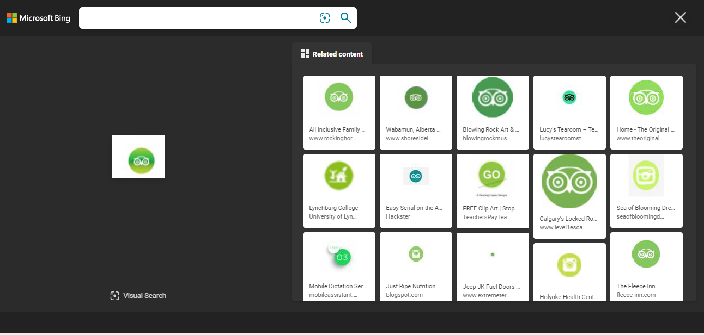
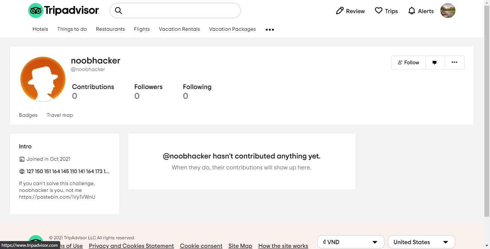

# Children OSINT - 100pts
### Challenge
> If you want to enter the world of OSINT, you need to overcome this challenge. Gathering information about noobhacker, knowing that he is using a social media platform with an owl logo.
### Solution
- Trước hết ta phải tìm được "social media platform with an owl logo"
- Sau khi vận hết khả năng search của các công cụ tìm kiếm thì mình đã kiếm được một xíu về cái "owl logo"
 
 - Và từ cái "owl logo" trên bức ảnh này mình sử dụng công cụ tìm kiếm hình ảnh của Bing để tìm tiếp cái logo đó:
 
 - Mình thử vào link web đầu tiên thì nó là một web bình thường rồi thử tìm xem trong web có owl logo hay không và tìm thấy ở cuối trang:
 
 - Click vào nó dẫn ta đến một trang web là [Tripadvisor](https://www.tripadvisor.com/)
 - Tìm kiếm noobhacker:
 
 - Thử link pastebin => mình đã bị lừa
 - Nhìn chỗ ghi thông tin số điện thoại mình đoán là flag được chuyển sang hệ cơ số 10
> 127 150 151 164 145 110 141 164 173 131 060 165 137 100 162 105 137 064 137 166 061 160 120 162 060 150 064 143 113 063 162 175

- Chuyển về Ascii ta sẽ nhận được flag.
- Flag: WhiteHat{Y0u_@rE_4_v1pPr0h4cK3r}
