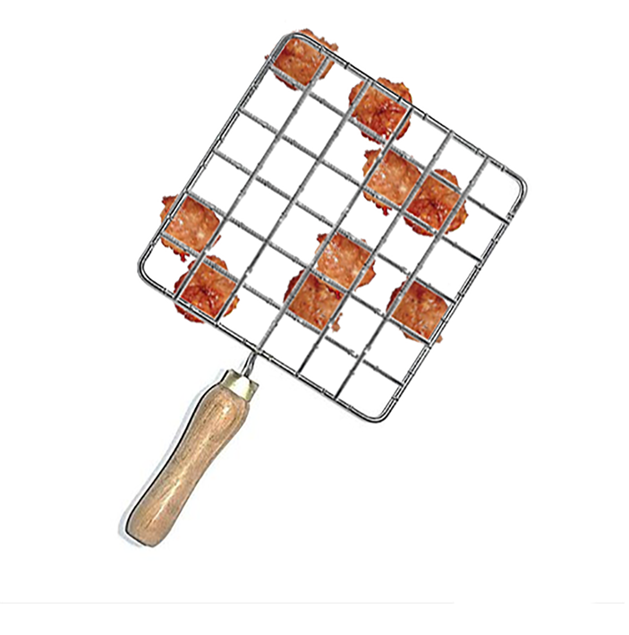

# Crypto02 - 200pts
### Challenge 
> I want to send this magic GRILL and secret recipe to a friend but I am concerned about its safety. Please help me ENCODE the recipe
My recipe: VhXRFIYvu2GV2oN9abdY7YVW5z9pInuXNV9F
[File](wonderful.png)

### Solution
> ENCODE the recipe
- Đây là yêu cầu của bài và mình đã thử tìm kiếm "GRILL" thì biết đây là một mã hóa.
- Cách encode cũng khá đơn giản như video [này](https://www.youtube.com/watch?v=IbmOJEGFlK4).
- Encode đoạn recipe bằng bức ảnh BTC cung cấp:

- Và nhận được đoạn base64: 
> V2hpdGVIYXR7YnVuX2NoNF9IYW5vaV9ubzF9
- Decode và mình nhận được flag
- Flag: WhiteHat{bun_ch4_Hanoi_no1}

