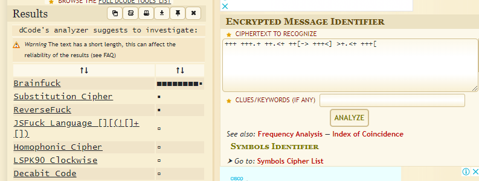

# Crypto05 - 150pts
### Challenge
>Hint: What is +++[]<--->... ?
[File](cipher.txt)
### Solution
- Đề cho mình một đoạn base 10:
```
053 053 053 053 053 040 053 053 053 133 055 040 076 053 053 053 053 040 053 053 053 053 074 040 135 076 053 053 053 040 053 053 053 053 053 040 053 053 053 056 053 040 053 053 056 074 053 040 053 053 133 055 076 040 053 053 053 074 135 040 076 053 056 074 053 040 053 053 053 133 055 015 012 076 055 055 055 055 040 074 135 076 055 055 040 056 053 053 053 053 040 053 053 053 056 056 040 053 053 053 053 053 040 053 056 074 053 053 040 053 053 053 133 055 040 076 055 055 055 055 040 055 074 135 076 055 040 055 055 055 055 055 040 055 055 056 074 053 040 053 053 053 133 055 015 012 076 053 053 053 053 040 074 135 076 053 053 040 053 053 053 056 053 040 053 053 053 053 053 040 053 056 055 055 055 040 055 055 055 055 055 040 056 056 053 053 053 040 053 053 053 053 056 040 074 053 053 053 133 040 055 076 053 053 053 040 074 135 076 053 053 040 053 056 055 055 055 015 012 055 055 056 055 055 040 055 055 055 055 056 040 055 056 053 053 053 040 053 056 074 053 053 040 053 053 053 133 055 040 076 055 055 055 055 040 055 074 135 076 055 040 055 055 055 055 056 040 074 053 053 053 053 040 053 053 133 055 076 040 053 053 053 053 053 040 053 074 135 076 056 015 012 074 053 053 053 053 040 133 055 076 055 055 040 055 055 074 135 076 040 056 074 053 053 053 040 133 055 076 053 053 040 053 074 135 076 053 040 053 056 074 053 053 040 053 133 055 076 055 040 055 055 074 135 076 040 055 055 055 055 055 040 056 056 074 053 053 040 053 133 055 076 053 015 012 053 053 074 135 076 040 053 053 056 074 053 040 053 053 053 053 133 040 055 076 055 055 055 040 055 055 074 135 076 040 055 056 074 053 053 040 053 053 133 055 076 040 053 053 053 053 074 040 135 076 053 053 053 040 056 055 056 074 053 040 053 053 053 133 055 040 076 055 055 055 055 015 012 074 135 076 055 055 040 055 056 074 053 053 040 053 053 053 133 055 040 076 053 053 053 053 040 053 074 135 076 053 040 053 053 053 056 055 040 055 055 055 055 055 040 055 056 074 053 053 040 053 133 055 076 053 040 053 053 074 135 076 040 053 053 053 056 074 040 053 053 053 133 055 015 012 076 055 055 055 074 040 135 076 055 055 055 040 056 074 053 053 053 040 053 133 055 076 053 040 053 053 053 074 135 040 076 056 074 053 053 040 053 053 053 053 133 040 055 076 055 055 055 040 055 055 055 074 135 040 076 055 056 074 053 040 053 053 053 133 055 040 076 053 053 053 053 015 012 074 135 076 056 074 040 053 053 053 133 055 040 076 053 053 053 074 040 135 076 053 053 053 040 053 053 056 074 053 040 053 053 053 053 133 040 055 076 055 055 055 040 055 055 074 135 076 040 055 055 055 055 056 040 074 053 053 053 053 040 133 055 076 053 053 040 053 053 074 135 076 015 012 053 053 053 053 053 040 056 053 053 053 056 040 055 055 055 055 055 040 056 074 053 053 053 040 053 133 055 076 055 040 055 055 055 074 135 040 076 055 055 055 055 040 055 056 055 055 056 040 074 053 053 053 053 040 053 053 133 055 076 040 053 053 053 053 053 040 053 074 135 076 053 015 012 053 056 055 055 055 040 055 055 056 053 056 040 074 053 053 053 053 040 053 133 055 076 055 040 055 055 055 055 074 040 135 076 055 055 055 040 055 055 055 055 055 040 055 056 074 053 053 040 053 053 133 055 076 040 053 053 053 053 074 040 135 076 053 053 053 040 053 053 053 053 056 015 012 056 074 053 053 053 040 133 055 076 053 053 040 053 074 135 076 053 040 053 053 053 056 074 040 053 053 053 053 053 040 133 055 076 055 055 040 055 055 055 074 135 040 076 055 055 055 055 040 055 055 055 055 055 040 055 056 074 053 053 040 053 053 053 053 133 040 055 076 053 053 053 015 012 053 053 053 074 135 040 076 056 074 053 053 040 053 053 133 055 076 040 055 055 055 055 074 040 135 076 056 074 053 040 053 053 133 055 076 040 053 053 053 074 135 040 076 053 053 053 056 040 074 053 053 053 053 040 133 055 076 055 055 040 055 055 074 135 076 040 056 055 056 053 053 015 012 053 053 053 056 055 040 055 055 055 055 056 040 074 053 053 053 053 040 133 055 076 053 053 040 053 053 074 135 076 040 056 053 053 053 053 040 056 074 053 053 053 040 133 055 076 055 055 040 055 074 135 076 055 040 055 055 055 056 053 040 053 053 053 053 053 040 053 053 056 055 055 015 012 055 055 055 055 055 040 056 074 053 053 053 040 133 055 076 053 053 040 053 074 135 076 053 040 053 053 056 055 055 040 055 055 055 055 055 040 055 055 056 055 055 040 055 056 074 053 053 040 053 133 055 076 053 040 053 053 074 135 076 040 053 053 053 053 053 040 056 074 053 053 053 015 012 053 133 055 076 055 040 055 055 055 074 135 040 076 055 055 055 056 040 074 053 053 053 053 040 133 055 076 055 055 040 055 055 074 135 076 040 055 055 055 056 074 040 053 053 053 053 053 040 133 055 076 053 053 040 053 053 053 074 135 040 076 053 053 056 074 040 053 053 053 053 053 015 012 133 055 076 055 055 040 055 055 055 074 135 040 076 055 055 056 074 040 053 053 053 053 053 040 133 055 076 053 053 040 053 053 053 074 135 040 076 053 053 053 056 040 053 053 056 055 055 040 055 055 055 055 056 040 053 053 056 055 055 040 055 055 056 053 053 040 053 053 053 053 053 015 012 053 053 056 053 053 040 053 053 053 053 053 040 053 056 074 053 053 040 053 053 053 053 133 040 055 076 055 055 055 040 055 055 055 074 135 040 076 055 055 055 056 040 074 053 053 053 053 040 053 133 055 076 053 040 053 053 053 053 074 040 135 076 053 053 053 040 053 053 053 053 053 015 012 053 053 056 055 055 040 055 055 055 055 055 040 056 053 053 053 053 040 056 074 053 053 053 040 053 053 133 055 076 040 055 055 055 055 055 040 074 135 076 055 055 040 055 055 055 055 056 040 074 053 053 053 053 040 133 055 076 053 053 040 053 053 074 135 076 040 053 053 056 074 053 015 012 053 053 053 133 055 040 076 055 055 055 055 040 074 135 076 055 055 040 055 056 053 056 074 040 053 053 053 053 133 040 055 076 053 053 053 040 053 074 135 076 053 040 053 053 053 053 053 040 053 056 074 053 053 040 053 053 133 055 076 040 053 053 053 053 074 040 135 076 056 074 053 015 012 053 053 133 055 076 040 055 055 055 074 135 040 076 055 055 056 053 040 053 053 053 053 053 040 053 056 074 053 053 040 053 133 055 076 055 040 055 055 074 135 076 040 055 055 055 055 055 040 056 055 056 074 053 040 053 053 053 133 055 040 076 055 055 055 055 040 074 135 076 055 055 015 012 055 056 074 053 053 040 053 053 053 133 055 040 076 053 053 053 053 040 053 074 135 076 053 040 053 053 053 053 053 040 056 055 055 055 055 040 055 055 055 056 074 040 053 053 053 133 055 040 076 053 053 053 074 040 135 076 053 053 053 040 056 074 053 053 053 040 133 055 076 055 055 015 012 055 074 135 076 055 040 055 055 055 055 056 040 074 053 053 053 053 040 133 055 076 055 055 040 055 055 074 135 076 040 055 055 055 055 055 040 056 074 053 053 053 040 053 133 055 076 053 040 053 053 053 074 135 040 076 053 053 053 053 040 053 053 056 055 055 040 055 055 055 055 056 015 012 055 055 056 074 053 040 053 053 133 055 076 040 053 053 053 074 135 040 076 053 053 056 074 040 053 053 053 133 055 040 076 055 055 055 074 040 135 076 055 055 056 040 074 053 053 053 133 040 055 076 053 053 053 040 074 135 076 053 053 040 056 055 055 056 074 040 053 053 053 133 055 015 012 076 055 055 055 074 040 135 076 055 055 056 040 074 053 053 053 053 040 133 055 076 053 053 040 053 053 074 135 076 040 053 053 053 053 053 040 053 053 053 056 074 040 053 053 053 053 133 040 055 076 055 055 055 040 055 074 135 076 055 040 055 055 055 055 056 040 074 053 053 053 053 015 012 133 055 076 055 055 040 055 055 074 135 076 040 055 055 056 074 053 040 053 053 133 055 076 040 053 053 053 074 135 040 076 053 053 056 056 040 056 074
```
- Decode được 1 đoạn ký tự:
```
+++++ +++[- >++++ ++++< ]>+++ +++++ +++.+ ++.<+ ++[-> +++<] >+.<+ +++[-
>---- <]>-- .++++ +++.. +++++ +.<++ +++[- >---- -<]>- ----- --.<+ +++[-
>++++ <]>++ +++.+ +++++ +.--- ----- ..+++ ++++. <+++[ ->+++ <]>++ +.---
--.-- ----. -.+++ +.<++ +++[- >---- -<]>- ----. <++++ ++[-> +++++ +<]>.
<++++ [->-- --<]> .<+++ [->++ +<]>+ +.<++ +[->- --<]> ----- ..<++ +[->+
++<]> ++.<+ ++++[ ->--- --<]> -.<++ ++[-> ++++< ]>+++ .-.<+ +++[- >----
<]>-- -.<++ +++[- >++++ +<]>+ +++.- ----- -.<++ +[->+ ++<]> +++.< +++[-
>---< ]>--- .<+++ +[->+ +++<] >.<++ ++++[ ->--- ---<] >-.<+ +++[- >++++
<]>.< +++[- >+++< ]>+++ ++.<+ ++++[ ->--- --<]> ----. <++++ [->++ ++<]>
+++++ .+++. ----- .<+++ +[->- ---<] >---- -.--. <++++ ++[-> +++++ +<]>+
+.--- --.+. <++++ +[->- ----< ]>--- ----- -.<++ ++[-> ++++< ]>+++ ++++.
.<+++ [->++ +<]>+ +++.< +++++ [->-- ---<] >---- ----- -.<++ ++++[ ->+++
+++<] >.<++ ++[-> ----< ]>.<+ ++[-> +++<] >+++. <++++ [->-- --<]> .-.++
+++.- ----. <++++ [->++ ++<]> .++++ .<+++ [->-- -<]>- ---.+ +++++ ++.--
----- .<+++ [->++ +<]>+ ++.-- ----- --.-- -.<++ +[->+ ++<]> +++++ .<+++
+[->- ---<] >---. <++++ [->-- --<]> ---.< +++++ [->++ +++<] >++.< +++++
[->-- ---<] >--.< +++++ [->++ +++<] >+++. ++.-- ----. ++.-- --.++ +++++
++.++ +++++ +.<++ ++++[ ->--- ---<] >---. <++++ +[->+ ++++< ]>+++ +++++
++.-- ----- .++++ .<+++ ++[-> ----- <]>-- ----. <++++ [->++ ++<]> ++.<+
+++[- >---- <]>-- -.+.< ++++[ ->+++ +<]>+ +++++ +.<++ ++[-> ++++< ]>.<+
++[-> ---<] >--.+ +++++ +.<++ +[->- --<]> ----- .-.<+ +++[- >---- <]>--
-.<++ +++[- >++++ +<]>+ +++++ .---- ---.< +++[- >+++< ]>+++ .<+++ [->--
-<]>- ----. <++++ [->-- --<]> ----- .<+++ +[->+ +++<] >++++ ++.-- ----.
--.<+ ++[-> +++<] >++.< +++[- >---< ]>--. <+++[ ->+++ <]>++ .--.< +++[-
>---< ]>--. <++++ [->++ ++<]> +++++ +++.< ++++[ ->--- -<]>- ----. <++++
[->-- --<]> --.<+ ++[-> +++<] >++.. .<
```
- Để biết được đây là loại mã hóa nào mình sử dụng [tool](https://www.dcode.fr/cipher-identifier) trên trang Dcode.
> => Brainfuck

- Decode Brainfuck => base 32:
```
KNXFMMS2GNFFMYTNMQ3WGRDDO5HG4QJVJZ5ES6KNI42XST2IIV3WGSCBGBRVIQJVMJXE2M2NPJLHQY2UNR3E23JZOVHG4SLXJ5KECNCNLAYD2===
```
- Tiếp tục mình nhận được đoạn base 64:
```
SnV2Z3JVbmd7cDcwNnA5NzIyMG5yOHEwcHA0cTA5bnM3MzVxcTlvMm9uNnIwOTA4MX0=
```
- Decode ra:
```
JuvgrUng{p706p97220nr8q0pp4q09ns735qq9o2on6r09081}
```
- Mình decode bằng trên trang [kt.gy](https://kt.gy/tools.html) nên kéo xuống rot13 là thấy flag.
Flag: WhiteHat{c706c97220ae8d0cc4d09af735dd9b2ba6e09081} 