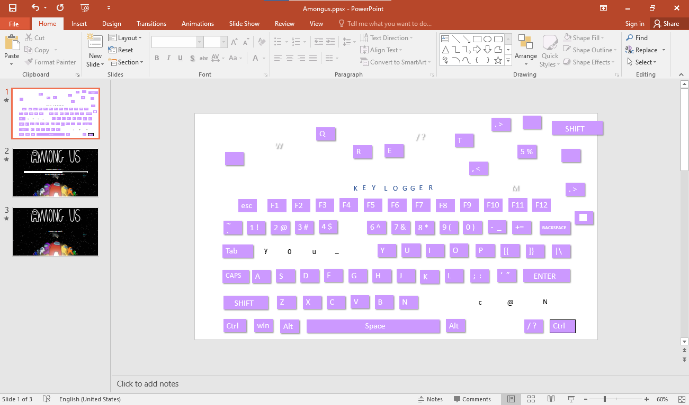

# Misc02 - 200pts
### Challenge
>My friend sent me the file and i forgot my password please help me open it.
Note: Flag has 3 parts
[File](misc02.rar)
### Solution
- Sau khi giải nén mình nhận được file zip đã bị khóa và không có hint gì từ đề nên mình đã bruteforce pass bằng [PassFab for ZIP](https://www.passfab.com/products/zip-password-recovery.html).
```
=> pass: morecats
```
- Sau khi giải nén mình tiếp tục nhận được 3 file ứng với 3 part của flag.
- Bắt đầu dễ dàng với [flaghere.txt](flaghere.txt) mình được mảnh đầu tiên.
```
WhiteHat{3v3ryThIng_ 
```
- Tiếp theo mình copy all ở [Imposter.docx](Imposter.docx) sau đó paste sang notepad và nhận được mảnh flag tiếp theo.
``` 
_Im@gIn3_IS_r3a1}
```
- Dùng powerpoint để mở và chỉnh sửa [Amongus.ppsx](Amongus.ppsx).
- Mảnh cuối cùng được dấu trong sile đầu tiên:

```
y0u_c@N
```
- Flag: WhiteHat{3v3ryThIng_y0u_c@N_Im@gIn3_IS_r3a1}


