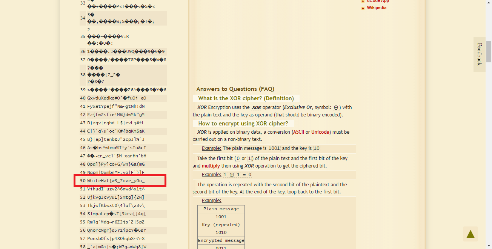
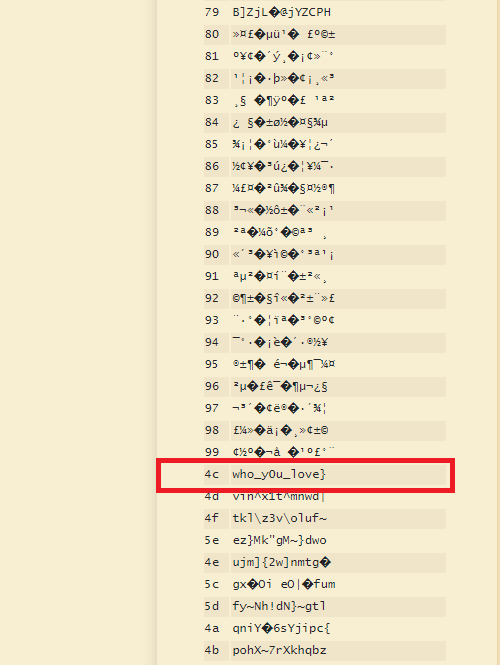

# Crypto03 - 100pts
### Challenge
> I'm xo xorry ,but I LOVE YOU
[File](3b242313357c391320233a2931.txt)
### Solution
- Bài này hint khá rõ ở mô tả mặc dù mình không hiểu lý do tác giả viết hoa "I LOVE YOU".
- Mình đã sử dụng tool [XOR](https://www.dcode.fr/xor-cipher) và bruteforce ra được 1 phần của flag.
 
- Tên file có thể là phần còn lại.                                                        

- Flag: WhiteHat{w3_7ove_y0u_who_y0u_love}
