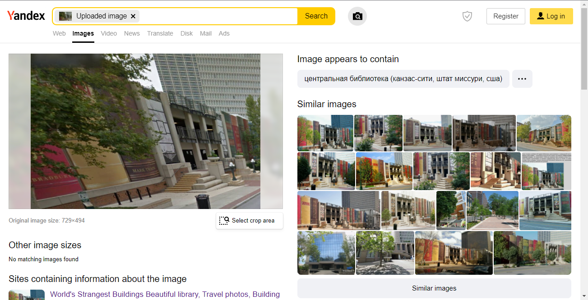
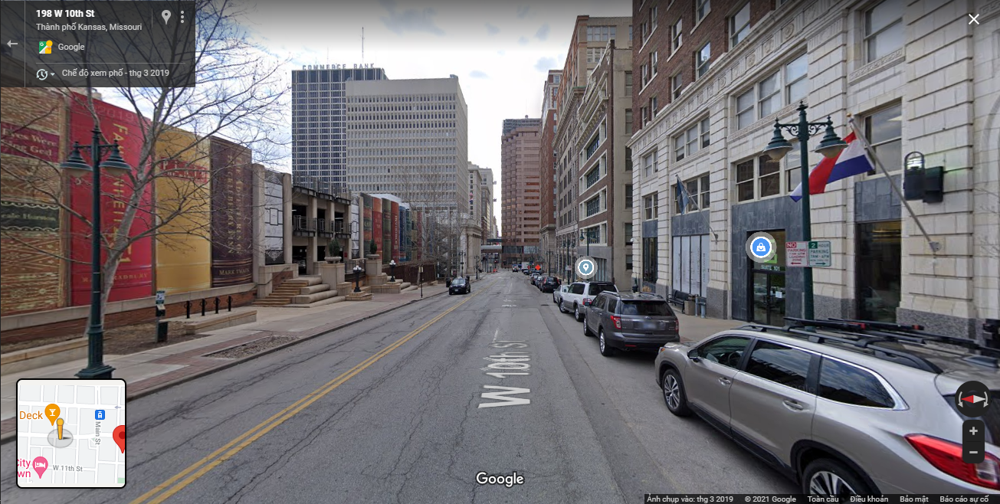
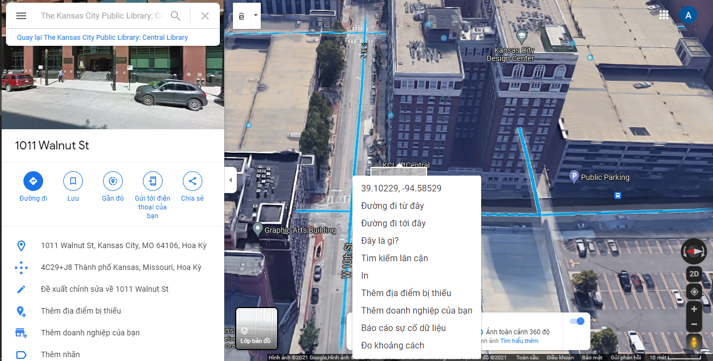
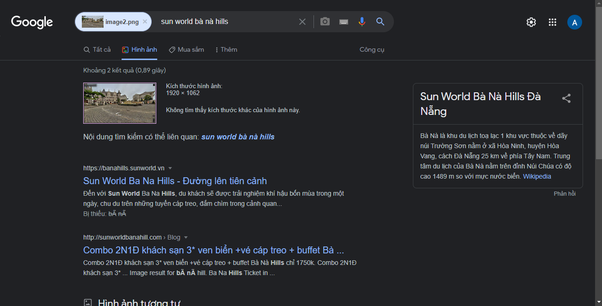
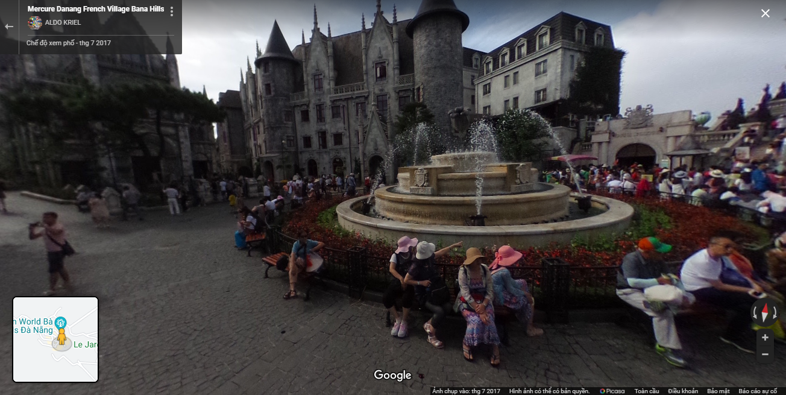
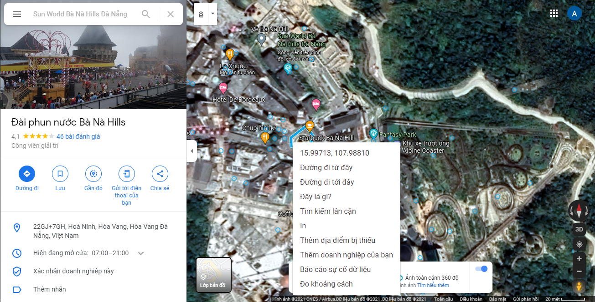

# GEOINT - 150pts
### Challenge
> Maybe you don’t like GeoGuessr game but it helps you to improve your OSINT skill.
Note: The flag format is WhiteHat{sha1(latitude1,longitude1_latitude2,longitude2)}. The coordinates precision is rounded to three decimal places.
> Download file here: https://drive.google.com/file/d/15GekpJCZlEQE6lRqE6-N50dLWmIVu5XZ/view?usp=sharing

### Solution
- Bài cho 2 bức ảnh và việc của mình là tìm vị trí 2 bức ảnh đó.
## [Image 1](image1.png)
- Với bức ảnh này mình sẽ sử dụng công cụ tìm kiếm hình ảnh của Yandex.
- Quan trọng là mình sẽ phải cắt đúng góc cần thiết để tìm kiếm dễ dàng và chính xác nhất.
- Nếu tìm full cả bức ảnh thì khả năng nhận được kết quả như ý là không cao.
- Ở đây mình chỉ tìm góc bên trái vì nó có chi tiết có thể là nổi tiếng và kết quả mình nhận được: 
```
 Kansas City Public Library
```


- Giờ mình sẽ sử dụng google map để xác định vị trí bức ảnh được chụp dựa vào tòa nhà được chụp trong ảnh:

- Đây là vị trí mình đã tìm được:

- Sau khi đã xác định được vị trí ta sẽ thu nhỏ bản đồ và click chuột phải vào vị trí đó để lấy tọa độ.

```
Tọa độ sau khi đã làm tròn đến 3 chữ số thập phân: 39.102,-94.585.
```
## [Image 2](image2.png)
- Bức ảnh này khá là dễ vì ta có thể dễ dàng tìm thấy bằng google.
```
Sun World Bà Nà Hills Đà Nẵng
```

- Tiếp tục với google map:

- Lấy tọa độ:

```
Tọa độ sau khi đã làm tròn đến 3 chữ số thập phân: 15.997,107.988.
```
- Ghép 2 tọa độ lại theo flag form:
> latitude1,longitude1_latitude2,longitude2

- Flag: 39.102,-94.585_15.997,107.988 

