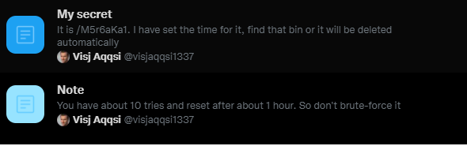

# Hello my future teammate! - 250pts
### Challenge
> I am looking for people who love OSINT and Security like me to join upcoming WhiteHat Grand Prix competition. We can be teammate if you find flag from my Github account. Remember that i really love OSINT and Security.
Note: The person in this challenge is unreal, he is not the author.

### Solution
- Đầu tiên mình sẽ dựa vào đề bài để tìm "OSINT and Security" trên Github và ở trang 2 mục user có thông tin mình cần.

- Github của người này chỉ có 2 repo mình đã kiểm tra hết các commit nhưng không nhận được gì.
- Thức sự thì mình đã bế tắc ở đây khá lâu cho đến khi mình nghĩ ra hướng tìm kiếm trên các mạng xã hội.
- Mình đã thử các mạng xã hội phổ biến như Instagram, Facebook,.... Và đến Twitter thì có kết quả:

- Đây là những thông tin ban đầu mình tìm thấy:

- Dựa vào thông tin đầu tiên mình tìm đến "View Lists" và nhận được thông tin tiếp theo:

- Tới đây mình đã nghĩ flag có lẽ được dấu trong một thứ gì đó có password nhưng cũng phải mất khá lâu để mình có thể tìm đc nó.
- Và cuối cùng mình đã tìm được đến 1 link [pastebin](https://pastebin.com/M5r6aKa1) có password:

- Vì mình chỉ có 10 lần thử pass và được reset trong sau 1h nên mình từ bỏ việc brute force để đi tìm password.
- Xem lại thì ở đây mình có 2 thông tin về password:
> Pass bị leak bởi jeanphorn. 
> Sau khi bị leak thì password được thêm sinh nhật vào cuối.
> Sau khi thêm sinh nhật vào thì pass có 24 ký tự.

- Sinh nhật được tìm thấy có 8 ký tự => mình phải tìm pass có 16 ký tự.                                                                          

- Tìm kiếm "jeanphorn" trên Github cho mình kết quả và anh ta cũng có các list password:                                                           

- Ban đầu mình đã thử lọc hết password 16 ký tự ra từ các list nhưng nó khá nhiều và không khả thi.
- Chắc chắn có cách khác để tìm pass và cũng mất khá lâu mình mới nghĩ ra thử tìm pass theo tên trên Twitter và Github.
- Password tìm thấy đúng 16 ký tự trong "passlist.txt":

- Công việc cuối cùng: thêm sinh nhật vào password để mở khóa pastebin và lấy flag:
```
pass: visjaqqsi10yxgf811111991
```

- Flag: WhiteHat{f1v3_st4r5_cH@ll3n9E_xD}

