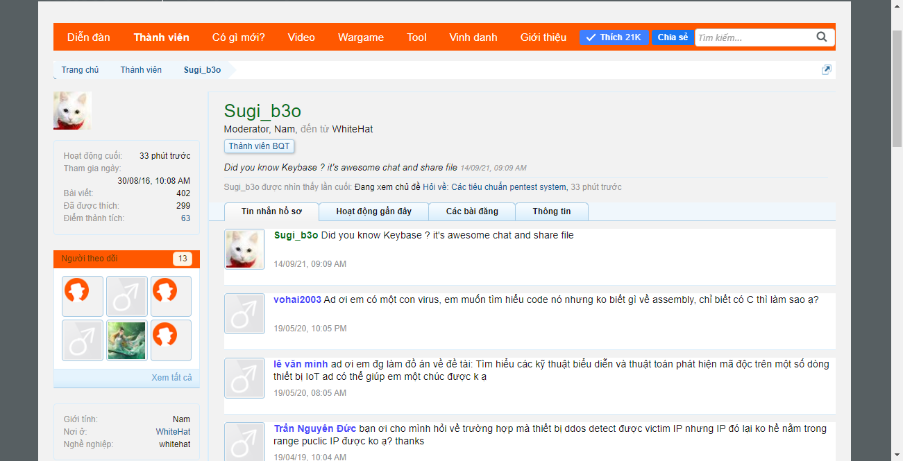
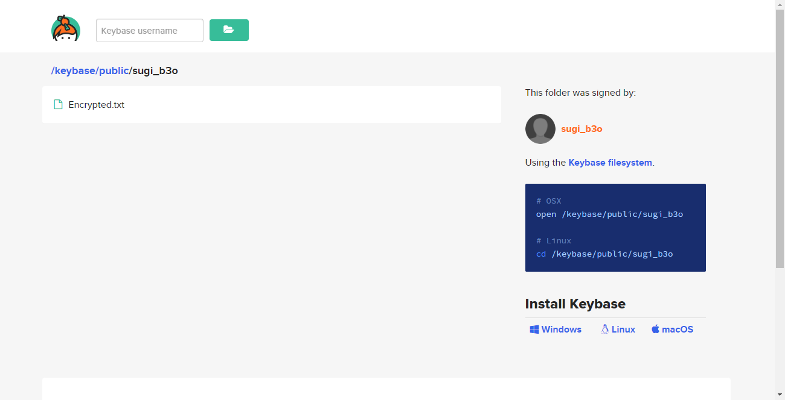

# Misc11 - 200pts
### Challenge
[File](whitehat.png)
### Solution
- Đầu tiên mình dùng HxD kiểm tra ảnh và tìm thấy thông tin về thành viên sugi_b3o trên trang WhiteHat.

- Lần theo hint mình tìm đến Keybase và tìm username sugi_b3o.

- Đi đến file Encrypted.txt thì thấy phần header là signature của file png => Encrypted.txt là 1 bức ảnh.
- Tải file về, ném hex data sang HxD và lưu dưới dạng png flag xuất hiện.

- Flag: Whitehat{How_did_y0u_f1nd_U5?}.
